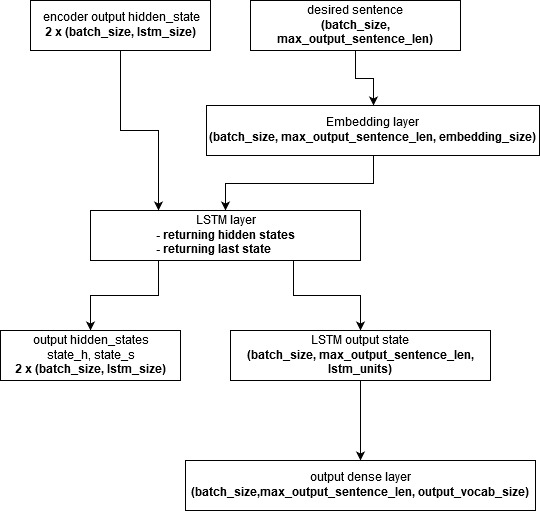
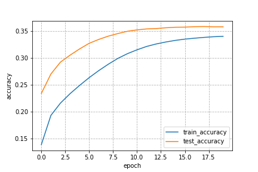
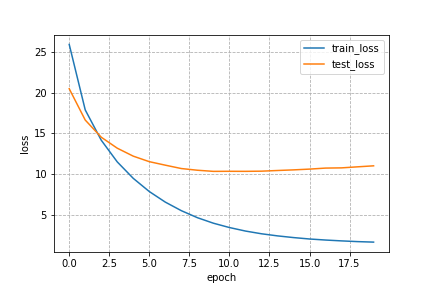

# Seq2Seq model

### TODO
- [x] write report
- [x] add results to report
- [ ] add beam search
- [ ] add bleu score
- [x] make collab notebook

### Overview
Seq2Seq model is encoder-decoder machine learning algorithm that can be used in
 - Machine Translation
 - Text Summarization
 - Conversational Modeling
 - Image Captioning
 - and in every task when we have sequenced input and want to get some output

That was described in : [Sequence to Sequence Learning with Neural Networks](https://arxiv.org/pdf/1409.3215.pdf) paper, where math and detailed explanation can be found.

In this case it is used for machine translation.
As name suggests it's made from two blocks: Encoder and Decoder, often called language model. Additionally (from what  I figured out) its better not to dd anything to encoder input sentence ( no tags ) and only add `<start>` tag at the beginning of decoder input sentence and `<end>` tag at the end of decoder output sentence.

Main idea is that Encoder encodes input sentence and return fixed length context vector, that contains embedding information that encoded managed to get. In practice context vector is last hidden state of encoder block and it`s barely good summary of input sentence, as it carries meaning of sentence, without any specific details about each word. This kind of information is then passed into decoder block as its input hidden state.


[Source](https://smerity.com/articles/2016/google_nmt_arch.html)

We can see that there are two inputs:

- encoder Original sentence input
- decoder Desired translation input

And one output:

- decoder translated output

### Colab notebook

link to Colab notebook can be found [here](https://github.com/mizzmir/NLP/blob/master/machine%20translation%20projects/Seq2Seq/Seq2SeqColab.ipynb)

### Encoder

Encoder part is straightforward and is build from two layers: Embedding layer  + LSTM layer, that returns hidden states/last LSTM state. As for encoder input, we get hidden states + input sequence we want to encode.

Let first focus on structure of encoder, on what we need and what shapes are during each step of encoding process.


No now when we have information about shapes it is easy to implement:

```python
class Encoder(tf.keras.Model):
  def __init__(self, vocab_size, embedding_size, units):
    super(Encoder, self).__init__()

    self.units = units
    self.embeding_layer = tf.keras.layers.Embedding(vocab_size, embedding_size, mask_zero=True, trainable=True)
    self.lstm_layer = tf.keras.layers.LSTM(units, dropout=0.2, return_sequences=True, return_state=True)
  
  def call(self, sequences, lstm_states, training_mode):
    # sequences shape = [batch_size, seq_max_len]
    # lstm_states = [batch_size, lstm_size] x 2
    # encoder_embedded shape = [batch_size, seq_max_len, embedding_size]
    # output shape = [batch_size, seq_max_len, lstm_size]
    # state_h, state_c shape = [batch_size, lstm_size] x 2

    encoder_embedded = self.embeding_layer(sequences, training=training_mode)
    #print("encoder_embedded = ", encoder_embedded.shape)
    output, state_h, state_c = self.lstm_layer(encoder_embedded, initial_state=lstm_states, training=training_mode)

    return output, state_h, state_c

  def init_states(self, batch_size):
        return (tf.zeros([batch_size, self.units]),
                tf.zeros([batch_size, self.units]))
```

Because we need initial hidden states for encoder, there is method init_states(...) added. It returns properly shaped hidden states. In case of using GRU layer, there will lbe only one hidden state , instead of two.

### Decoder

Decoder part is also straightforward and build from three layers: Embedding layer + LSTM layer + Dense layer.
As input Decoder gets hidden states from encoder output + desired sequence starting with `<start>` tag.
Again it`s good to visualize input shapes before diving into code.



And corresponding code:

```python
class Decoder(tf.keras.Model):
  def __init__(self, vocab_size, embedding_size, units):
    super(Decoder, self).__init__()

    self.embedding_layer = tf.keras.layers.Embedding(vocab_size, embedding_size)
    self.lstm_layer = tf.keras.layers.LSTM(units, dropout=0.2, return_sequences=True,
                                           return_state=True)
    self.dense_layer = tf.keras.layers.Dense(vocab_size)
  
  def call(self, sequences, lstm_states, training_mode):
    # sequences shape = [batch_size, seq_max_len]
    # embedding shape = [batch_size, seq_max_len, embedding_size]
    # output shape = [batch_szie, seq_max_len, lstm_size]
    # state_h, state_c = [batch_size, lstm_size] x2
    # dense shape = [batch_size, seq_max_len, vocab_size]
    
    decoder_embedded = self.embedding_layer(sequences, training=training_mode)
    lstm_output, state_h, state_c = self.lstm_layer(decoder_embedded, lstm_states, training=training_mode)
    return self.dense_layer(lstm_output), state_h, state_c
```

Both encoder and decoder code plus small shapes test can be found [here](https://github.com/mizzmir/NLP/blob/master/machine%20translation%20projects/Seq2Seq/model.py)

### Input Preprocessing

Preprocessing is  process that has to be done before we can feed data into our model. It consists of few parts:

- **data normalization**

    This step assures that all sentences are in ascii format, clean unwanted tokens, spaces before punctuations, changes to lowercase etc. Mostly contains general cleanup of text. It`s common to use two below methods (usually it's enough but you may want to add something extra for example leave some language specific characters or to leave some tokens)

    ```python
    def unicode_to_ascii(s):
        return ''.join(
            c for c in unicodedata.normalize('NFD', s)
            if unicodedata.category(c) != 'Mn')

    def normalize(s):
        s = unicode_to_ascii(s)
        s = re.sub(r'([!.?])', r' \1', s)
        s = re.sub(r'[^a-zA-Z.!?-]+', r' ', s)
        s = re.sub(r'\s+', r' ', s)
        return s
    ```

- **splitting data into train/test set and expanding desired decoder input/output sequences**

    It's done by adding `<start>` or `<end>` token respectively to train/test data.

- **padding and tokenization**

    Sentences are zero padded, so they will be same length, and tokenized into vectors of tokens (integers) with proper Tokenizer.
    In this case build in tensorflow tokenizer is use, but one can use nltk tokenizer, scipy tokenizer etc..
    We have to save both input and output language tokenizers to de-tokenize sentences later in prediction phase.

    ```python
    def preprocessSeq(texts, tokenizer):
        texts = tokenizer.texts_to_sequences(texts)

        return pad_sequences(texts, padding='post')

    def tokenizeInput(input_data, tokenizer):
        output_data = []
        for data in input_data:
            tokenizer.fit_on_texts(data)

        for data in input_data:
            output_data.append(preprocessSeq(data, tokenizer))

        return output_data
    ```

    subroutines can be found [here](https://github.com/mizzmir/NLP/blob/master/machine%20translation%20projects/utilities/utils.py)

    whole preprocess routine can be found [here](https://github.com/mizzmir/NLP/blob/master/machine%20translation%20projects/preprocessing/preprocessor.py) plus code is pasted below:


    ```python
    def preprocess_data(inputs, outputs, tokenizer_names, shuffle_needed=True):
    """
        Method for input and output data preprocessing.
        It consist of following steps:
        1. shuffling, if shuffle set to True. Default value : True
        1. normalizing data
        2. splitting data into train/test
        3. creating/loading tokenizers
        4. adding <start> and <end> tokens into train/test data
        5. padding train/test data
        
        Parametrs:
            inputs - data that needs to be translated
            outputs - target translations
            tokenizer_names - names of tokenizer files
            shuffle_needed - should data be shuffled. Default value : True
        
        returns:
            train_data - data vector consting preprocessed train data in form: (input, output_in, output_out)
            test_data - data vector consting preprocessed test data in form: (input, output_in, output_out)
            prediction_data - only normalized intput, output datas
            tokenizers - tokenizers for input and output languages
    """
    
    input_tokenizer_name, output_tokenizer_name = tokenizer_names
    
    input_data = copy.deepcopy(inputs)
    output_data = copy.deepcopy(outputs)
    
    if shuffle_needed:
        input_data, output_data = shuffle(input_data, output_data)
    
    input_data = [normalize(line) for line in input_data]
    output_data = [normalize(line) for line in output_data]

    input_train, intput_test, output_train, output_test = train_test_split(input_data, output_data, shuffle=True, test_size=0.1)

    intput_lines = intput_test
    output_lines = output_test
    
    tokenizer_data = {input_tokenizer_name : input_train,
                 output_tokenizer_name : output_train}
    input_tokenizer, output_tokenizer = get_tokenizers(tokenizer_data)
    print("Tokenizers created\n  {} vocab size {}\n  {} vocab size {}" \
      .format(input_tokenizer_name, input_tokenizer.vocab_size, \
              output_tokenizer_name, output_tokenizer.vocab_size))
    
    # train dataset
    output_train_in = [[output_tokenizer.vocab_size] + output_tokenizer.encode(line) for line in output_train]
    output_train_out = [output_tokenizer.encode(line) + [output_tokenizer.vocab_size+1] for line in output_train]

    output_train_in = pad_sequences(output_train_in, padding='post')
    output_train_out = pad_sequences(output_train_out, padding='post')

    # test dataset
    output_test_in = [[output_tokenizer.vocab_size] + output_tokenizer.encode(line) for line in output_test]
    output_test_out = [output_tokenizer.encode(line) + [output_tokenizer.vocab_size+1] for line in output_test]

    output_test_in = pad_sequences(output_test_in, padding='post')
    output_test_out = pad_sequences(output_test_out, padding='post')

    input_train = [input_tokenizer.encode(line) for line in input_train]
    intput_test = [input_tokenizer.encode(line) for line in intput_test]

    input_train = pad_sequences(input_train, padding='post')
    intput_test = pad_sequences(intput_test, padding='post')

    train_data = [input_train, output_train_in, output_train_out]
    test_data = [intput_test, output_test_in, output_test_out]
    prediction_data = [intput_lines, output_lines]
    tokenizers = [input_tokenizer, output_tokenizer]

    return train_data, test_data, prediction_data, tokenizers
    ```

### training loop

Now lets talk about training loop. In order to make use of multiple GPUs, few things has to be done. Custom training loop using multiple GPUs in tensorflow 2.0 is nicely described [here](https://www.tensorflow.org/tutorials/distribute/custom_training)

In order to use multiple GPUs we have to create `MirroredStrategy` and then do whole training under its scope. Additionally we cannot use normal `tf.Datasets`, because we want to "distribute it over multiple models on different GPUs. To do this we have to do two things:

1. set desired **BATCH_SIZE** for all models
2. use `strategy.experimental_distribute_dataset`

As for first, we have to multiply desired **BATCH_SIZE** we want to pass to single model, with number of GPUs we want to use. We can do this by simple `BATCH_SIZE * GUP_number` multiplication to use fixed number of GPUs, or use `strategy.num_replicas_in_sync` that will give us all available GPUs.

```python
print ('Number of devices: {}'.format(self.strategy.num_replicas_in_sync))
GLOBAL_BATCH_SIZE = self.batch_size*self.strategy.num_replicas_in_sync
```

Where:
    `self.strategy = tf.distribute.MirroredStrategy()`

After this, during each training step **GLOBAL_BACH_SIZE** samples wil be taken from dataset and distributed among all models, so we each model will get **BATCH_SIZE** batch size of data.

Now when we have out desired **GLOBAL_BATCH_SIZE** let's create train/test datasets. Because we`re using distributed training our desired batch_size will be **GLOBAL_BATCH_SIZE**.

```python
train_dataset = tf.data.Dataset.from_tensor_slices((en_train, fr_train_in, fr_train_out))
train_dataset = train_dataset.shuffle(len(en_train), reshuffle_each_iteration=True)\
                                .batch(GLOBAL_BATCH_SIZE, drop_remainder=True)
train_dataset_distr = self.strategy.experimental_distribute_dataset(train_dataset)

test_dataset = tf.data.Dataset.from_tensor_slices((en_test, fr_test_in, fr_test_out))
test_dataset = test_dataset.shuffle(len(en_test), reshuffle_each_iteration=True)\
                                .batch(GLOBAL_BATCH_SIZE, drop_remainder=True)
test_dataset_distr = self.strategy.experimental_distribute_dataset(test_dataset)
```

Only different thing, from non-distributed datasets are  in last lines for both test/train datasets

From this point everything we'll do, will be done under the score of `tf.strategy.MirroredStrategy()`.

1. **We have to create Encoder/Decoder/Optimizer under strategy scope:**

```python
            self.optimizer = tf.keras.optimizers.Adam(clipnorm=5.0)
            self.encoder = Encoder(en_vocab_size, self.embedding_size, self.lstm_size)
            self.decoder = Decoder(fr_vocab_size, self.embedding_size, self.lstm_size)
```

2. **Loss function**

The next thing to do is to define a loss function. Because sequence is padded with zeros, we cannot take it into account when calculating loss. This will be handled with proper mask:

```python
loss_obj = tf.keras.losses.SparseCategoricalCrossentropy(from_logits=True, 
                                                            reduction="none") 
def compute_loss(predictions, labels):
    mask = tf.math.logical_not(tf.math.equal(labels, 0))
    mask = tf.cast(mask, tf.int64)
    per_example_loss = loss_obj(labels, predictions, sample_weight=mask)
    return tf.nn.compute_average_loss(per_example_loss, global_batch_size=GLOBAL_BATCH_SIZE)
```

We're using `from_logits=True` because decoder output is not after softmax activation, so we're not passing probabilities, just values.
mask is used to zero padded values and is passed to loss obj with `sample_weight` parameter. Same result can be obtained by multiplying predicted data by mask and then passing result to `loss_obj`

Because we`re using distributed training we have to take average loss. we can do the same thing by hand  with simple math:

`output_loss = tf.reduce_sum(per_example_loss)*1./GLOBAL_BATCH_SIZE`

but tensorflow 2.0 has build in method to do this : `tf.nn.compute_average_loss(...)`

3. **Distributed train/test steps**

Train and test step are almost the same so I`ll get into train step and point different in test step
Because we`re creating custom training loop there are two things we can use to speed up computations:

- use `@tf.function` to use static graph computation. We have to use it only in one method, because every method called from it will automatically using it. Additionally it will speed up calculations, due to optimization tensorflow makes when it uses it.  **to debug code please remove it, use tf.print(...) not normal python print(...)**
- training step uses `tf.GradientTape()` to keep track of gradients and allow backpropagation.

train_step(...) method makes one forward pass of training + applies gradients.
distributed_train_step(...) makes distributional part happens:

- we have to use `tf.strategy.MirroredStrategy.experimental_run_v2(method_name, args=(... ,))`   <- **IMPORTANT COMA AT THE END**
  to get distributed losses(vector of losses)
- then `tf.strategy.MirroredStrategy.reduce(tf.distribute.ReduceOp.SUM, ...)` to take sum of losses and calculate output loss from whole distributed models

```python
# one training step
def train_step(encoder_input, decoder_in, decoder_out, initial_states):
    with tf.GradientTape() as tape:
        encoder_states = self.encoder(encoder_input, initial_state, training_mode=True)
        predicted_data, _, _ = self.decoder(decoder_in, encoder_states[1:], training_mode=True)
        loss = compute_loss(predicted_data, decoder_out)

    trainable = self.encoder.trainable_variables + self.decoder.trainable_variables
    grads = tape.gradient(loss, trainable)
    self.optimizer.apply_gradients(zip(grads, trainable))
    train_accuracy.update_state(decoder_out, predicted_data)
    return loss

@tf.function
def distributed_train_step(encoder_input, decoder_in, decoder_out, initial_states):
    per_replica_losses = self.strategy.experimental_run_v2(train_step,
                                                    args=(encoder_input,
                                                        decoder_in,
                                                        decoder_out,
                                                        initial_states,))
    return self.strategy.reduce(tf.distribute.ReduceOp.SUM, per_replica_losses,
                        axis=None)
```

Test_step differences:

- there is no `tf.GradientTape` + backpropagation step
- `training_mode=False` for encoder/decoder object

```python
def test_step(encoder_input, decoder_in, decoder_out):
    initial_state = self.encoder.init_states(self.batch_size)
    encoder_states = self.encoder(encoder_input, initial_state, tratraining_modeining=False)
    predicted_data, _, _ = self.decoder(decoder_in, encoder_states[1:], training_mode=False)
    loss = compute_loss(predicted_data, decoder_out)

    test_accuracy.update_state(decoder_out, predicted_data)
    return loss

@tf.function
def distributed_test_step(encoder_input, decoder_in, decoder_out):
    per_replica_losses = self.strategy.experimental_run_v2(test_step,
                                                    args=(encoder_input,
                                                        decoder_in,
                                                        decoder_out,))
    return self.strategy.reduce(tf.distribute.ReduceOp.SUM, per_replica_losses,
                        axis=None)
```

4. **Prediction step**

Basically what`s going on here is following:

- Encoding of input sentence with encoder
- Decoder gets `<start>` symbol + encoder last hidden states as input
- Decoder predicts next symbol in output sequence + returns new hidden states
- Predicted symbol is passed as new decoder input along with previously returned hidden states
- This process is repeated until `<end>` token is predicted or max length is reached

```python
def predict(self, en_sentence, fr_sentence):
  tokenized_en_sentence = self.en_tokenizer.texts_to_sequences([en_sentence])
  initial_states = self.encoder.init_states(1)
  _, state_h, state_c = self.encoder(tf.constant(tokenized_en_sentence), initial_states, training_mode=False)

  symbol = tf.constant([[self.fr_tokenizer.word_index['<start>']]])
  sentence = []

  while True:
      symbol, state_h, state_c = self.decoder(symbol, (state_h, state_c), training_mode=False)
      # argmax to get max index 
      symbol = tf.argmax(symbol, axis=-1)
      word = self.fr_tokenizer.index_word[symbol.numpy()[0][0]]

      if word == '<end>' or len(sentence) >= len(fr_sentence):
          break

      sentence.append(word)
    
  predicted_sentence = ' '.join(sentence)
  print("--------------PREDICTION--------------")
  print("  English   :  {}" .format(en_sentence))
  print("  Predicted :  {}" .format(predicted_sentence))
  print("  Correct   :  {}" .format(fr_sentence))
  print("------------END PREDICTION------------")
```

5. **Main loop**

During every epoch we train/test our models on split datasets. Train/test accuracy and losses are printed each `N` iterations and losses/accuracy values are added to proper lists, so we can plot them after.

```python
for epoch in range(epochs):
    test_accuracy.reset_states()
    train_accuracy.reset_states()
    initial_state = self.encoder.init_states(self.batch_size)
    total_loss = 0.0
    num_batches = 0
    for _, (en_data, fr_data_in, fr_data_out) in enumerate(train_dataset_distr):
        loss = distributed_train_step(en_data, fr_data_in, fr_data_out, initial_state)
        total_loss += loss
        num_batches += 1
    train_losses.append(total_loss/num_batches)
    total_loss = 0.0
    num_batches = 0
    for _, (en_data, fr_data_in, fr_data_out) in enumerate(test_dataset_distr):
        loss = distributed_test_step(en_data, fr_data_in, fr_data_out)
        total_loss += loss
        num_batches += 1
    test_losses.append(total_loss/num_batches)
    print ('Epoch {} training Loss {:.4f} Accuracy {:.4f}  test Loss {:.4f} Accuracy {:.4f}' .format(
                                            epoch + 1, 
                                            train_losses[-1], 
                                            train_accuracy.result(),
                                            test_losses[-1],
                                            test_accuracy.result()))
```

1. **Saving checkpoint**

One more thing that's going on here is saving model/optimizer value each `N` iterations. It's done with `tf.train.Checkpoint`. For details please see [tensorflow site](https://www.tensorflow.org/guide/checkpoint)

Whole training process code can be found [here](https://github.com/mizzmir/NLP/blob/master/machine%20translation%20projects/Seq2Seq/Seq2SeqTrainer.py)

7. **Results**

Accuracy plot:



Accuracy seems similar between training and testing sets

Loss plot:



We can see that during 20 epochs model starts to flatten it`s loss chart.
