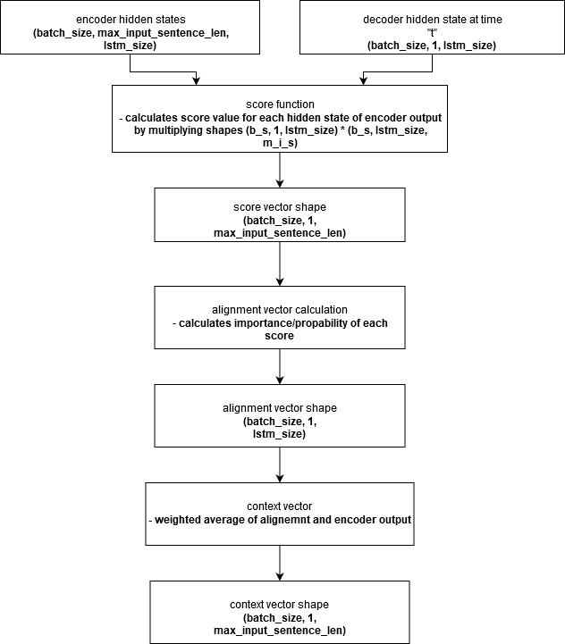

# Seq2Seq model

### TODO
- [ ] write report
- [ ] add results to report
- [ ] add beam search
- [ ] add bleu score
- [ ] make collab notebook

### Overview
Seq2Seq model with Attention  is encoder-decoder machine learning algorithm that uses Attention mechanism and  can be used in

 - Machine Translation
 - Text Summarization
 - Conversational Modeling
 - Image Captioning
 - and in every task when we have sequenced input and want to get some output

Classic Seq2Seq models have problem with processing long sequence, because they depends on single, fixed length context vector. Additionally those models look at model we want to translate only one time, as a whole, and use this input to produce every part of output. Attention models allow to look at every single part of input and based on that they produce decoder output.

Just line in Seq2Seq models without attention, Encoder part of Attention model, take input sentence we want to translate and during each timestep  it produces hidden states, one for ach sequence input. And here big difference appears.

In model without attention, only last hidden state vector is passed to Decoder, and because of that it has fixed length size (one hidden size), what leads to not so good results when handling longer sequences.
In model with attention Decoder gets all of the hidden states that encoder produces. Benefit of this is visible when we're handling longer sequences. Because we don't have fixed length context vector, so longer sentences will have longer context vectors that will capture input sequence information better than fixed length vector.

If we go one step further, we can say that because we have variable length of context vector, and each hidden state mostly captures information about corresponding element from input sequence. For example if we have 4 word sequence , then first hidden state captures first word the most, second second etc..
Additionally each hidden state, because it was generated using LSTM/GRU, captures information's about whole sentence, word dependencies etc. so we have many more information's than in vanilla Seq2Seq models.

#TODO: ADD GENERAL PICTURE

We can see that there are two inputs:

- encoder Original sentence input
- decoder Desired translation input

And one output:

- decoder translated output

### Colab notebook

link to Colab notebook can be found [here](https://github.com/mizzmir/NLP/blob/master/machine%20translation%20projects/Seq2Seq/Seq2SeqColab.ipynb)

### Encoder

Encoder part is the same as in vanilla Seq2Seq model, with only one difference: output data.
Encoder part is straightforward and is build from Embedding layer  + LSTM layers that **returns all hidden states**. Those info are then passed to decoder as input, with decoder Desired translation input. As for encoder input, we get hidden states + input sequence we want to encode.

Let first focus on structure of encoder, on what we need and what shapes it will have during each step of encoding process.


No now when we have information about shapes it is easy to implement:

```python
class Encoder(tf.keras.Model):
  def __init__(self, vocab_size, embedding_size, units):
    super(Encoder, self).__init__()

    self.units = units
    self.embeding_layer = tf.keras.layers.Embedding(vocab_size, embedding_size, mask_zero=True, trainable=True)
    self.lstm_layer = tf.keras.layers.LSTM(units, dropout=0.2, return_sequences=True, return_state=True)
  
  def call(self, sequences, lstm_states):
    # sequences shape = [batch_size, seq_max_len]
    # lstm_states = [batch_size, lstm_size] x 2
    # encoder_embedded shape = [batch_size, seq_max_len, embedding_size]
    # output shape = [batch_size, seq_max_len, lstm_size]
    # state_h, state_c shape = [batch_size, lstm_size] x 2

    encoder_embedded = self.embeding_layer(sequences)
    #print("encoder_embedded = ", encoder_embedded.shape)
    output, state_h, state_c = self.lstm_layer(encoder_embedded, initial_state=lstm_states)

    return output, state_h, state_c

  def init_states(self, batch_size):
        return (tf.zeros([batch_size, self.units]),
                tf.zeros([batch_size, self.units]))
```

Because we have to get initial hidden states for encoder, that are all zeros at the start of every training step, there is method init_states(...) added. It returns properly shaped hidden states. In case of using GRU layer, there will be only one hidden state , instead of two.

### Attention mechanism

In vanilla Seq2Seq model encoder information is passed only to first node/ first timestep of Decoder network. due to that this information will become less and less relevant every next time step. To solve this we would like to have encoder output available at every time step of decoder and this is main idea behind attention. because of this during training process we have to pass only one token as decoder input to predict one token output and repeat till end of input tokens. During each time we make attention  do it`s magic.

We do this by creating **context vector**. Let me explain math behind it

1. We have to calculate so called **score** function

here we have few options to choose from, as can be seen below:


where:
ht - current decoder output state
hs - all source states given by encoder

Scoring function assigns score to each of the hidden states at given timestep "t". Higher the score, more important given hidden state is for given decoder timestep.

2. When we have our score of each encoder hidden states, we can calculate so called **alignment vector**

Alignment vector tells us what is probability/importance of each element using score value we calculated before.
It`s main purpose is to say how important/ assigns weights for each hidden state of encoder for given timestep "t" in decoder. The highest probability, the most important given element is.

It`s done by taking softmax of score function. After this we have vector, that is same length as source sequence, with probability/importance of each element. Shape of this vector should be intuitive, because we want some way to measure what hidden state to focus at given timestep, so we have to take weighted average ( what is done in next step) of all hidden states and to do this we need some kind of weights.


3. When we have importance weights for each element, it`s time for calculating final step of our attention mechanism: **context vector**
'
Context vector is done by simply multiplying **alignment vector** with **encoder output**. This operation is nothing more than weighted average of encoder output. With this operation we have attention values for given timestep.


Because in attention we're calculating output for each output timestep, it`s nice to visualise shapes again:



Main difference is between score functions we choose to use, but later on calculations are straightforward.

* `dot` score function is best suited when both encoder and decoder have same embedding size/embedding space
* `general` score function is better suited when encoder and decoder have different embedding space, that's the case when we`re doing language translation. The reason for that is weights matrix that is added between multiplication of encoder and decoder states.
* `concat` can be use in all cases

Whole attention calculations are done with below class:

```python
class LuangAttention(tf.keras.Model):
def __init__(self, lstm_size, attention_type):
    super(LuangAttention, self).__init__()

    self.W_a = tf.keras.layers.Dense(lstm_size, name="LuangAttention_W_a")
    self.W_a_tanh = tf.keras.layers.Dense(lstm_size, activation="tanh", name="LuangAttention_W_a_tanh")
    self.v_a = tf.keras.layers.Dense(1)
    self.type = attention_type

def call(self, decoder_output, encoder_output):
    # encoder_output shape [batch_size, seq_max_len, hidden_units_of_encoder]
    # decoder_output shape [batch_size, 1, hidden_units of decoder]
    # score shape [batch_size, 1, seq_max_len]
    if self.type == "dot":
        score = tf.matmul(decoder_output, encoder_output, transpose_b=True)
    elif self.type == "general":
        score = tf.matmul(decoder_output, self.W_a(encoder_output), transpose_b=True)
    elif self.type == "concat":
        decoder_output = tf.broadcast_to(decoder_output, encoder_output.shape)
        concated = self.W_a_tanh(tf.concat((decoder_output, encoder_output), axis=-1))
        score = tf.transpose(self.v_a(concated), [0,2,1])
    else:
        raise Exception("wrong score function selected")
        
    alignment_vector = tf.nn.softmax(score, axis=2)
    context_vector = tf.matmul(alignment_vector, encoder_output)

    return context_vector, alignment_vector
```

### Decoder

Decoder part is where the Attention magic happens. Vanilla Seq2Seq decoder was build easy way : embedding ++ LSTM + Dense layers. It also looks at whole sequence at once and based on this one look + context vector from encoder (last hidden state) it creates translation output, whole at once.

In Seq2Sq with attention there is different idea how decoder should work. During each timestep it will get three inputs (in compare vanilla Seq2Seq gets only two inputs):

* decoder desired output token (**only one token**)
* encoder outputs  (**from all hidden states**)
* last hidden states (**in first decoder timestep those are from encoder last layer, later from decoder last iteration**)
  
Starting point is the same as in vanilla Seq2Seq: we have Embedding layer + LSTM layer that we feed decoder desired input + last hidden states into.
Next steps are new to attention model: we`re calculating context vector basing on encoder outputs + lstm output state. As a result we get two vectors:

* context vector (**we need it later in decoder**)
* alignment vector (**we can print out attention weights with it. Not needed for calculations**)
  
Next we do some math to calculate decoder output:


* concating lstm_output and context vector together
* weighting it with `tanh` activation function
* passing it through `Dense` layer to get decoder output
  
Again it`s good to visualize input shapes before diving into coding.


And corresponding code with shapes as comments:

```python
class Decoder(tf.keras.Model):
  def __init__(self, lstm_units, embedding_size, vocab_size, attention_type):
    super(Decoder, self).__init__()

    self.units = lstm_units
    self.embedding_layer = tf.keras.layers.Embedding(vocab_size, embedding_size, name="Decoder_embedding")
    self.lstm_layer = tf.keras.layers.LSTM(lstm_units, dropout=0.2, return_sequences=True, return_state=True, name="Decoder_lstm")
    self.dense_layer = tf.keras.layers.Dense(vocab_size)
    self.attention = LuangAttention(lstm_units, attention_type)

    self.W_c = tf.keras.layers.Dense(lstm_units, activation="tanh", name="Attention_W_c")
    self.W_s = tf.keras.layers.Dense(vocab_size, name="Attention_W_s")

  def call(self, decoder_input, hidden_states, encoder_output):
    # decoder_input shape [batch_size, 1]
    # hidden_states shape 2*[batch_size, lstm_size]
    # encoder_output shape [batch_size, seq_max_len, lstm_size]
    embedded_input = self.embedding_layer(decoder_input)
    # embedded_input shape [batch_size, 1, embedding_size]
    # lstm_out shape [batch_size, 1, lstm_size]
    # state_h, state_c shape 2*[batch_szie, lstm_size]
    lstm_out, state_h, state_c = self.lstm_layer(embedded_input, hidden_states)

    # context shape [batch_size, 1 lstm_size]
    # alignment shape [batch_size, 1, source_len]
    context, alignment = self.attention(lstm_out, encoder_output)

    # lstm_out shape [batch_size, lstm_size + lstm_size]
    lstm_out = tf.concat([tf.squeeze(context, axis=1), tf.squeeze(lstm_out, axis=1)], axis=1, name="Decoder_concat")

    # output_vector shape [batch_size, lstm_units]
    output_vector = self.W_c(lstm_out)

    # conversion to vocabulary prob
    # output_vector shape [batch_size, vocab_size]
    output_vector = self.W_s(output_vector)
    return output_vector, state_h, state_c
```

Both attention layer, encoder and decoder code can be found [here](https://github.com/mizzmir/NLP/blob/master/machine%20translation%20projects/Seq2SeqAttention/model.py)

### Input Preprocessing

Preprocessing is  process that has to be done so we can push data into our model. It consists of few parts:

- **data normalization**

    In this step we're assuring that all sentences are in ascii format, cleaning unwanted tokens, spaces before punctuations, changing to lowercase etc. Mostly contains general cleanup of text. It`s common to use two below methods (usually it's enough but sometimes you may want to add something extra for example leave some language specific characters or to leave some tokens)

```python
def unicode_to_ascii(s):
    return ''.join(
        c for c in unicodedata.normalize('NFD', s)
        if unicodedata.category(c) != 'Mn')

def normalize(s):
    s = unicode_to_ascii(s)
    s = re.sub(r'([!.?])', r' \1', s)
    s = re.sub(r'[^a-zA-Z.!?-]+', r' ', s)
    s = re.sub(r'\s+', r' ', s)
    return s
```

- **splitting data into train/test set and expanding desired decoder intput/output sequences**
It's done by adding `<start>` or `<end>` token respectively.

- **padding and tokenization**
    Sentences are zero padded, so they will be same length, and tokenized into vectors of tokens (integers) with proper Tokenizer.
    In this case build in tensorflow tokenizer was used, but one can use nltk tokenizer, scipy tokenizer etc..
    We have to save both input and output language tokenizers to de-tokenize sentences later in prediction phase.

```python
def preprocessSeq(texts, tokenizer):
texts = tokenizer.texts_to_sequences(texts)

return pad_sequences(texts, padding='post')

def tokenizeInput(input_data, tokenizer):
    output_data = []
    for data in input_data:
        tokenizer.fit_on_texts(data)

    for data in input_data:
        output_data.append(preprocessSeq(data, tokenizer))

    return output_data
```

subroutines can be found [here](https://github.com/mizzmir/NLP/blob/master/machine%20translation%20projects/utilities/utils.py)

whole preprocess routine can be found [here](https://github.com/mizzmir/NLP/blob/master/machine%20translation%20projects/Seq2SeqAttention/main.py) plus code is pasted below:

```python
en_lines = [normalize(line) for line in en_lines]
fr_lines = [normalize(line) for line in fr_lines]

en_train, en_test, fr_train, fr_test = train_test_split(en_lines, fr_lines, shuffle=True, test_size=0.1)

fr_train_in = ['<start> ' + line for line in fr_train]
fr_train_out = [line + ' <end>' for line in fr_train]

fr_test_in = ['<start> ' + line for line in fr_test]
fr_test_out = [line + ' <end>' for line in fr_test]

fr_tokenizer = Tokenizer(filters='')
en_tokenizer = Tokenizer(filters='')

input_data = [fr_train_in, fr_train_out, fr_test_in, fr_test_out, fr_test, fr_train]
fr_train_in, fr_train_out, fr_test_in, fr_test_out, fr_test, fr_train = tokenizeInput(input_data,
                                                                                      fr_tokenizer)

input_data = [en_train, en_test]
en_train, en_test = tokenizeInput(input_data, en_tokenizer)
```

### Training loop

Now lets talk about training loop. In order to make use of multiple gpus, few things has to be done. Custom training loop using multiple GPUs in tensorflow 2.0 is nicely described [here](https://www.tensorflow.org/tutorials/distribute/custom_training)

In order to use multiple GPU-s we have to create `MirroredStrategy` and then do whole training under its scope. Additionally we cannot use normal `tf.Datasets`, because we want to "distribute it over multiple models on different GPUs. To do this we have to do two things:

1. set desired **BATCH_SIZE** for all models
2. use `strategy.experimental_distribute_dataset` 

As for first, we have to multiply desired **BATCH_SIZE** that we want to pass to single model, with number of GPUs we want to use. We can do this by simple `BATCH_SIZE * GUP_number` multiplication to use fixed number of GPUs, or use `strategy.num_replicas_in_sync` that will give us all available GPUs.

```python
print ('Number of devices: {}'.format(self.strategy.num_replicas_in_sync))
GLOBAL_BATCH_SIZE = self.batch_size*self.strategy.num_replicas_in_sync
```

Where:
    `self.strategy = tf.distribute.MirroredStrategy()`

After this , during each training step **GLOBAL_BATCH_SIZE** samples will be taken from dataset and distributed among all models, so we each model will get **BATCH_SIZE** batches that we want.

Now when we have out desired GLOBAL_BATCH_SIZE let's create train/test datasets. Because we`re using distributed training our desired batch_size will be **GLOBAL_BATCH_SIZE**.

```python
train_dataset = tf.data.Dataset.from_tensor_slices((en_train, fr_train_in, fr_train_out))
train_dataset = train_dataset.shuffle(len(en_train), reshuffle_each_iteration=True)\
                               .batch(GLOBAL_BATCH_SIZE, drop_remainder=True)
train_dataset_distr = self.strategy.experimental_distribute_dataset(train_dataset)

test_dataset = tf.data.Dataset.from_tensor_slices((en_test, fr_test_in, fr_test_out))
test_dataset = test_dataset.shuffle(len(en_test), reshuffle_each_iteration=True)\
                              .batch(GLOBAL_BATCH_SIZE, drop_remainder=True)
test_dataset_distr = self.strategy.experimental_distribute_dataset(test_dataset)
```

Only different thing , from non-distributed datasets are last lines for both test/train datasets

From this point everything we'll do, will be done under the score of strategy.MirroredStrategy().

1. **We have to create Encoder/Decoder/Optimizer under strategy scope:**

```python
self.optimizer = tf.keras.optimizers.Adam(clipnorm=5.0)
self.encoder = Encoder(en_vocab_size, self.embedding_size, self.lstm_size)
self.decoder = Decoder(fr_vocab_size, self.embedding_size, self.lstm_size)
```

2. **Loss function**

The next thing to do is to define a loss function. Because sequence is padded with zeros, we cannot take it into account when calculating loss. This will be handled with proper mask:

```python
loss_obj = tf.keras.losses.SparseCategoricalCrossentropy(from_logits=True, 
                                                         reduction="none") 
def compute_loss(predictions, labels):
    mask = tf.math.logical_not(tf.math.equal(labels, 0))
    mask = tf.cast(mask, tf.int64)
    per_example_loss = loss_obj(labels, predictions, sample_weight=mask)
    return tf.nn.compute_average_loss(per_example_loss, global_batch_size=GLOBAL_BATCH_SIZE)
```

We're using `from_logit=True` because decoder output is not after softmax activation, so we're not passing probabilities, just values.
mask is used to zero padded values and is passed to loss obj with `sample_weight` parameter. Same result can be obtained by multiplying predicted data by mask and then passing result to `loss_obj`

Because we`re using distributed training we have to take average loss. we can do the same thing by hand  with simple math:

`output_loss = tf.reduce_sum(per_example_loss)*1./GLOBAL_BATCH_SIZE`

but tensorflow 2.0 has build in method to do this

1. **Distributed train/test steps**  

Train and test step are almost the same so I`ll get into train step and point different in test step
Because we`re creating custom training loop there are two things we can use to speed up computations:

- use `@tf.function` to use static graph computation. We have to use it only in one method, because every method called inside it will automatically using it. Additionally it will speed up calculations, due to optimalization tensorflow makes when it uses it.  **to debug code please remove it, use tf.print(...) not normal python print(...)**
- training step uses `tf.GradientTape()` to keep track of gradients and allow backpropagation.

train_step(...) method makes one forward pass of training + applys gradients.
distributed_train_step(...) makes distributional part happens:

- we have to use `tf.strategy.MirroredStrategy.experimental_run_v2(method_name, args=(... ,))`   <- **IMPORTANT COMA AT THE END**
  to get distributed losses(vector of losses)
- then `tf.strategy.MirroredStrategy.reduce(tf.distribute.ReduceOp.SUM, ...)` to take sum of losses and calculate output loss from whole distributed models

Main difference between vanilla Seq2Seq and Seq2Seq with Attention is what input it takes during forward pass.
In vanilla Seq2Seq we could pass whole sequence into Decoder model, because encoder hidden states only matters during first timestep. Apart of that it was pure RNN network, so whole sequence is passed as input, RNN is unrolling itself and process whole sequence at once.

When Attention mechanism is added it changes everything. Because Decoder sequence is processed one timestep a time; during each timestep context/attention vectors have to be calculated and Decoder output at this particular timestep has to be predicted, we have to iterate through decoder intput sequence, token by token. We iterate that way until we reach end of decoder input sequence.

This can be seen in below code:

```python
# one training step
def train_step(en_data, fr_data_in, fr_data_out, initial_states):
    loss = 0
    one_step_test_accuracy.reset_states()
    with tf.GradientTape() as tape:
        encoder_output, state_h, state_c = self.encoder(en_data, initial_states, training=True)
        # shape[1] because we want each word for all batches
        for i in range(fr_data_out.shape[1]):
            decoder_input = tf.expand_dims(fr_data_in[:,i], 1)
            decoder_output, state_h, state_c = self.decoder(decoder_input,
                                                            (state_h, state_c),
                                                            encoder_output,
                                                            training=True)
            loss +=compute_loss(decoder_output, fr_data_out[:,i])
            one_step_test_accuracy.update_state(decoder_output, fr_data_out[:,i])

    trainable_vars = self.encoder.trainable_variables + self.decoder.trainable_variables
    grads = tape.gradient(loss, trainable_vars)
    self.optimizer.apply_gradients(zip(grads, trainable_vars))

    train_accuracy.update_state(one_step_test_accuracy.result())
    return loss / fr_data_out.shape[1]

@tf.function
def distributed_train_step(encoder_input, decoder_in, decoder_out, initial_states):
    per_replica_losses = self.strategy.experimental_run_v2(train_step,
                                                  args=(encoder_input,
                                                        decoder_in,
                                                        decoder_out,
                                                        initial_states,))
    return self.strategy.reduce(tf.distribute.ReduceOp.SUM, per_replica_losses,
                       axis=None)
```

Test step is almost the same as train step with following differences:

- there is no `tf.GradientTape` + bakcpropagation step
- `training=False` for encoder/decoder object

```python
def test_step(en_data, fr_data_out):
    loss = 0
    one_step_test_accuracy.reset_states()
    initial_states = self.encoder.init_states(self.batch_size)
    encoder_output, state_h, state_c = self.encoder(en_data, initial_states, training=False)

    decoder_input = tf.constant(self.fr_tokenizer.word_index['<start>'], shape=(self.batch_size, 1))

    for i in range(fr_data_out.shape[1]): 
        decoder_output, state_h, state_c = self.decoder(decoder_input,
                                                        (state_h, state_c),
                                                        encoder_output,
                                                        training=False)
        decoder_input =tf.expand_dims(tf.argmax(decoder_output, 1),1)
        loss +=compute_loss(decoder_output, fr_data_out[:,i])
        one_step_test_accuracy.update_state(decoder_output, fr_data_out[:,i])
    
    train_accuracy.update_state(one_step_test_accuracy.result())
    return loss/fr_data_out.shape[1]

@tf.function
def distributed_test_step(en_data, fr_data_out):
    per_replica_losses = self.strategy.experimental_run_v2(test_step,
                                                     args=(en_data,
                                                           fr_data_out,))
    return self.strategy.reduce(tf.distribute.ReduceOp.SUM, per_replica_losses, axis=None)
```

1. **Prediction step**

It`s forward pass but feeded with <start> token at the beginnning.
Next steps are basically:

- take decoder output
- if it's `<end>` token break prediction loop
- else feed output of decoder last step as decoder input and repeat 

```python
def predict(en_sentence, fr_sentence):
    real_en_sentence =' '.join([self.en_tokenizer.index_word[i] for i in en_sentence if i not in [0]]) 
    fr_sentence = ' '.join([self.fr_tokenizer.index_word[i] for i in fr_sentence if i not in [0]]) 
    en_sentence = tf.expand_dims(en_sentence, 0)
    initial_states = self.encoder.init_states(1)
    encoder_out, state_h, state_c = self.encoder(tf.constant(en_sentence), initial_states, training=False)

    decoder_in = tf.constant([[self.fr_tokenizer.word_index['<start>']]])
    sentence = []
    while True:
        decoder_out, state_h, state_c = self.decoder( \
                        decoder_in, (state_h, state_c), encoder_out, training=False)
        # argmax to get max index 
        decoder_in = tf.expand_dims(tf.argmax(decoder_out, -1), 0)
        word = self.fr_tokenizer.index_word[decoder_in.numpy()[0][0]]

        if  word == '<end>':
            break
        sentence.append(word)

    predicted_sentence = ' '.join(sentence)
    
    print("----------------------------PREDICTION----------------------------")
    print("       En sentence {} " .format(real_en_sentence))
    print("       Predicted:  {} " .format(predicted_sentence))
    print("       Should be:  {} " .format(fr_sentence))
    print("--------------------------END PREDICTION--------------------------")
```

5. **Main loop**

During every epoch we train/test our models on split datasets. Train/test accuracy and losses are printed each `N` iterations and losses/accuracy values are added to proper lists, so we can plot them after.

```python
for epoch in range(epochs):
    test_accuracy.reset_states()
    train_accuracy.reset_states()
    initial_states = self.encoder.init_states(self.batch_size)
    
    total_loss = 0.0
    num_batches = 0
    for _, (en_data, fr_data_in, fr_data_out) in enumerate(train_dist_dataset):
        loss = distributed_train_step(en_data, fr_data_in, fr_data_out, initial_states)
        total_loss += loss
        num_batches += 1
    train_losses.append(total_loss/num_batches)
    total_loss = 0.0
    num_batches = 0
    for _, (en_data, fr_data_out) in enumerate(test_dist_dataset):
        loss = distributed_test_step(en_data, fr_data_out)
        total_loss += loss
        num_batches += 1
    
    test_losses.append(total_loss/num_batches)
    print ('Epoch {} training Loss {:.4f} Accuracy {:.4f}  test Loss {:.4f} Accuracy {:.4f}' .format( \
                                      epoch + 1, 
                                      train_losses[-1], 
                                      train_accuracy.result(),
                                      test_losses[-1],
                                      test_accuracy.result()))
```

1. **Saving checkpoint**

One more thing that's going on here is saving model/optimizer value each `N` iterations. It's done with `tf.train.Checkpoint`. For details please see [tensorflow site](https://www.tensorflow.org/guide/checkpoint)

Whole training process code can be found [here](https://github.com/mizzmir/NLP/blob/master/machine%20translation%20projects/Seq2SeqAttention/Seq2SeqAttentionTrainer.py)

7. **Results**

Accuracy plot:

Loss plot:
